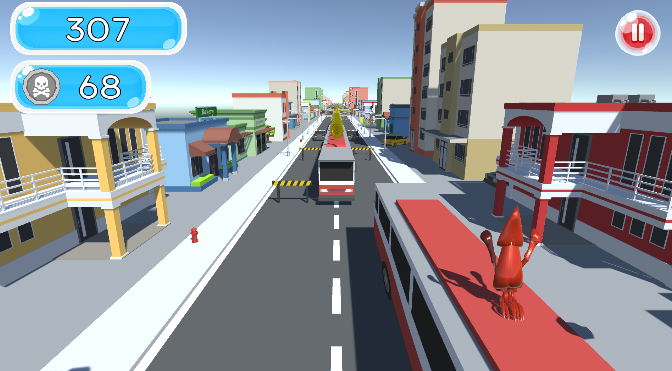

# 🐙 수조를 나온 5징어

**「수조를 나온 5징어」**는 Unity 기반으로 제작된 3D 러닝 액션 게임입니다.  
플레이어는 수조에서 탈출한 오징어를 조작해 장애물을 피하고 아이템을 수집하며, 가능한 한 멀리 도망치는 것이 목표입니다.

---

## 🎮 게임 특징

- 서브웨이 서퍼처럼 **무한히 이어지는 트랙**에서 끝없이 달리는 러닝 게임입니다.
- 간단한 키 조작으로 다양한 액션을 수행할 수 있습니다.
- 다양한 아이템 효과로 재밌는 플레이가 가능합니다.

---

## 🔧 조작 방법

| 조작 키 | 기능 설명                      |
|--------|-------------------------------|
| ←      | 왼쪽 라인으로 이동               |
| →      | 오른쪽 라인으로 이동              |
| ↑      | 점프                           |
| ↓      | 슬라이딩                        |
| ↑ + ↓  | 급강하 (공중에서 빠르게 착지 가능)  |

---

## 🧩 아이템 종류 및 효과

| 아이템       | 효과 설명                                 |
|--------------|--------------------------------------------|
| 🪙 코인        | 코인 증가                                  |
| 🧲 자석        | 주변 코인을 자동으로 수집          |
| 🦑 슈퍼점프     | 점프력이 강화되어 높은 장애물을 넘을 수 있음         |
| 💥 파워업      | 일정 시간 동안 무적 상태로 장애물을 파괴하며 돌파 가능    |
| ✌️ 코인 2배    | 일정 시간 동안 획득 코인 수 2배 증가               |

---

## 🖼️ 게임 예시 이미지

---

## 📌 개발 정보

- **엔진**: Unity 2022.3.17f  
- **장르**: 3D Endless Runner (러닝 액션)  
- **플랫폼**: PC (Windows)

---

## 👥 팀 구성

| 역할         | 이름     | 담당 업무                             |
|--------------|----------|----------------------------------------|
| 팀장         | 김영진    | UI 시스템, 점수 시스템     |
| 팀원         | 김영훈    | UI 시스템, 사운드 시스템                 |
| 팀원         | 김가람    | 플레이어 이동, 애니메이션                    |
| 팀원         | 송정훈    | 맵 시스템 및 디자인                 |
| 팀원         | 이영민    | 맵 시스템 및 디자인               |
| 팀원         | 김재영    | 아이템 시스템               |

---

## 📦 사용 에셋 목록

> 아래 에셋은 상업적 사용이 가능한 외부 무료 에셋입니다.  
> Git 저장소에는 포함하지 않으며, 팀원은 각자 다운로드하여 사용합니다.

- 아이템 :
  - 코인 https://magic-games.itch.io/low-poly-pirate-coin
  - 아이템 https://assetstore.unity.com/packages/3d/props/mobile-power-ups-free-vol-1-36106
- BGM : https://assetstore.unity.com/packages/audio/sound-fx/free-casual-game-sfx-pack-54116
- 맵, 장애물 : https://assetstore.unity.com/packages/3d/environments/simplepoly-city-low-poly-assets-58899
---

즐겁게 플레이해 주세요! 🏃‍♂️
